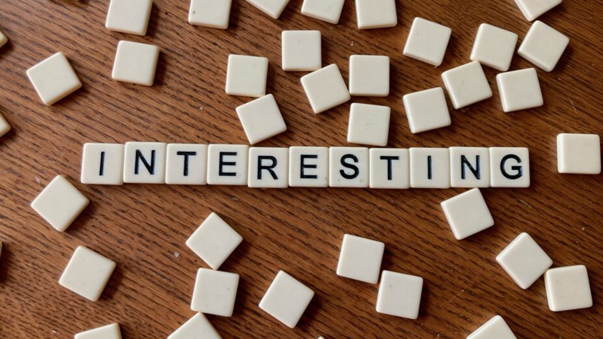

# _When Interesting Is Not Interesting at All_

by Natálie Němcová

4th of November 2023

 

When I think about a word that triggers a negative response in me, it has to be: interesting. I’m not fond of this adjective because it can come of as being vague and alibis. It does not have a strong meaning and can be more confusing than useful. Especially if this is the answer you get when you ask somebody a question. It often offers no value because and holds a connotations that are neither positive or negative. And that might be a point why it is used to widely and freely. Because it does not give a clear answer yet offers an easy way out of any conversation. It’s often considered to be a proper reaction to give to things you don’t fully understand. Or when you want to sugarcoat something, you don’t like that much. 

What I mean by that is those awkward social interactions when you perhaps made something that you poured your heart into, and this is the response you got. That small moment of silence. Then the air thickens. And the other person has no idea, what to tell you about that so-called masterpiece you just made. So, they simply say: “Ooh, interesting…“ But what most people mean by that (well, not always, but bear with me) is something like: “Uh…I do not share your emotional investment in this.“

Or “I just don’t understand it at all, and I don’t care. I’ll just give you a short answer and we can keep going.“

Or “Well. I do not like this at all, but I want to be polite about it. I don’t want to hurt your feelings.“ 

“That’s interesting.“ They might mumble and change the subject fairly quickly. 

Does it always mean they are not sincere? No. Some people using this word, may be really interested in something you said. But if they just give you this short answer, and then immediately go somewhere else, they are usually not.  

But if they actually meant it, they would ask you some more questions. Heck, if they are not a fan of your work, they can still try to see your point of view. People can still be supportive of something they don’t fully understand. Or maybe they can give you some decent criticism. But if they say “interesting“ and throw it from the window in the speed of lighting, it might be a “That’s weird“ dressed in a nice pair of shoes. Or in a that cozy sweater they got from their good old granny. And you like their grannie’s cookies, don’t you? 

So just shut your mouth, eat your cookies, and let me change the “interesting“ subject really quickly. 

## Process 

- [revision](revision.md)
- [edit](edit.md)
- [firstdraft](index.md) 

