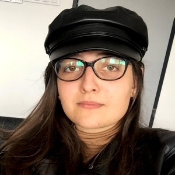
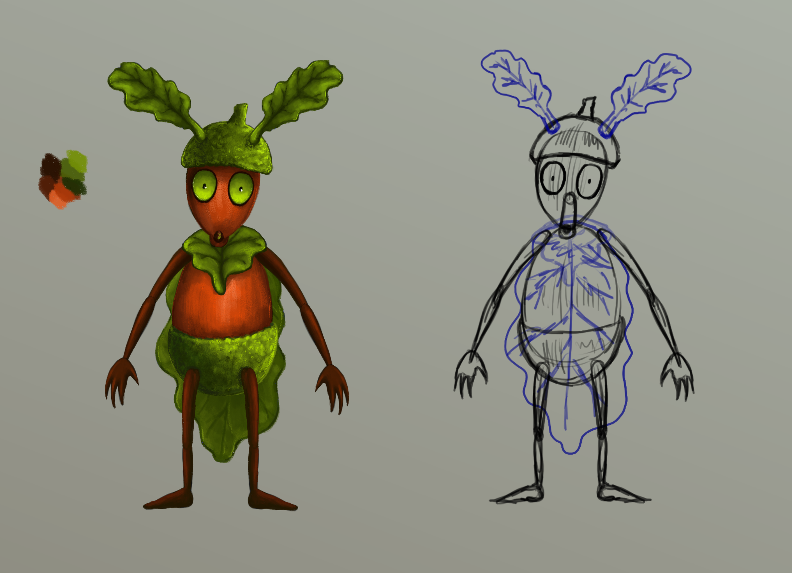
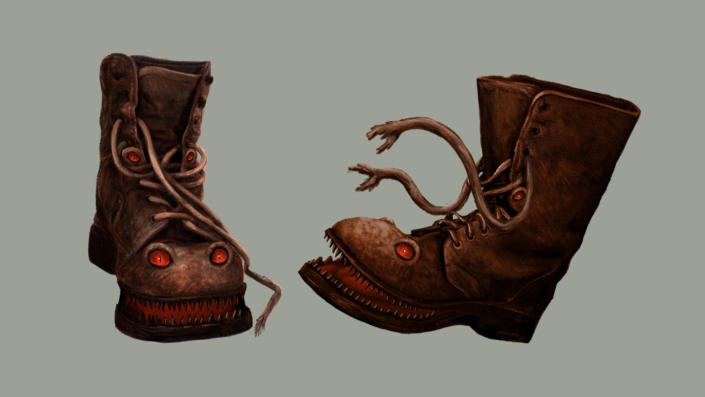
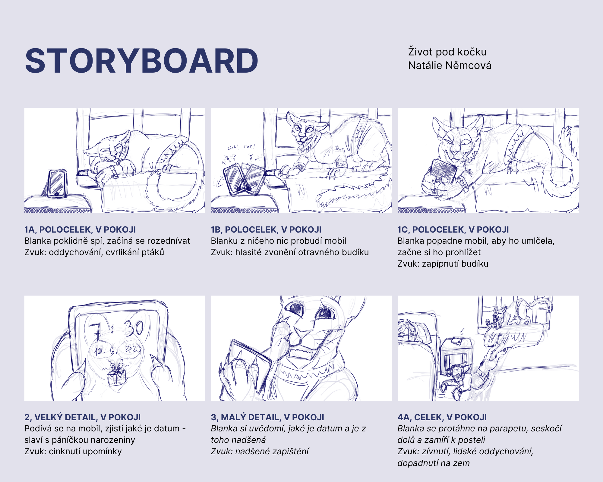
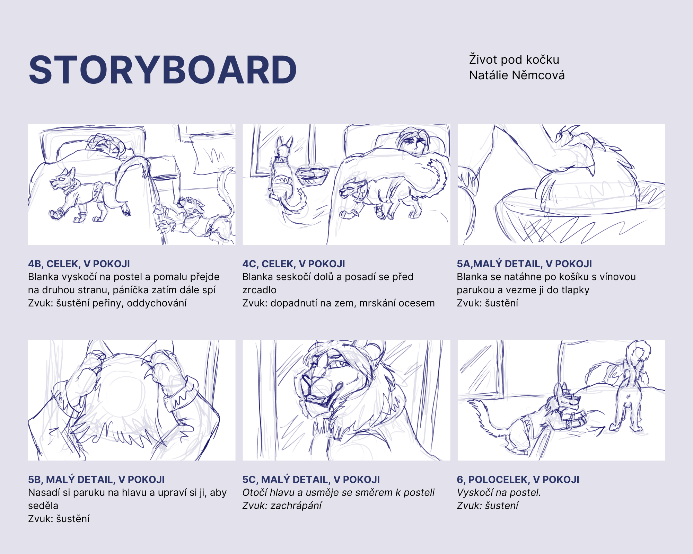
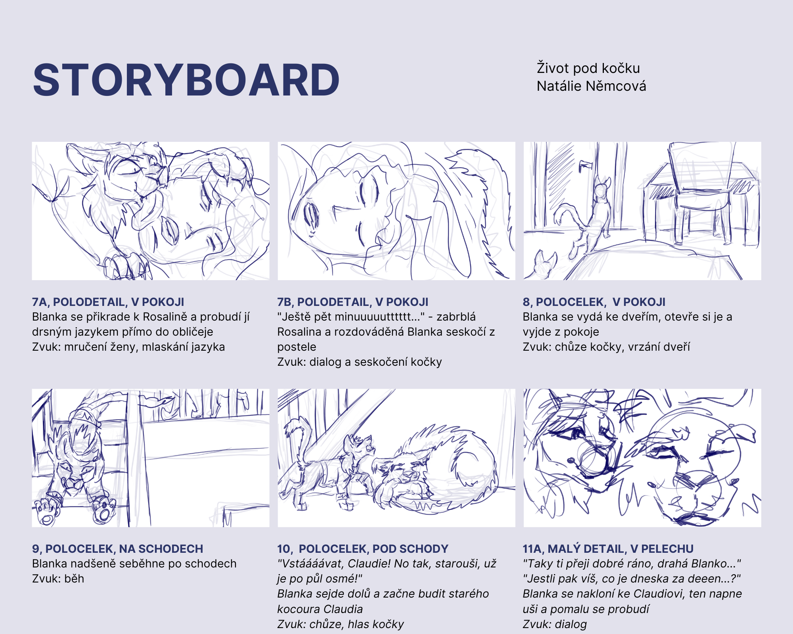
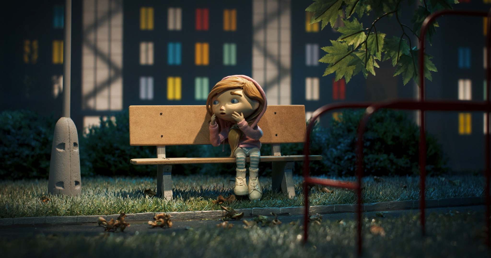

# First impression

- [Presentation](Presentation.md)
- [Story of my life](Story_of_my_life.md)
- [About](About.md)
- [Featured projects](FeaturedProjects.md)

## [About](About.md)

Hi, my name is Natálie Němcová. 
I’m an aspiring illustrator, 3D sculptor, animator and writer with love for dark folktales and storytelling. 
I have been fascinated by nature and fantastical creatures as long as I could remember it left a great impact on my work. 
I devoted my life to studying works of art, animated films and European mythology. 
I’m still trying to find my own creative voice. 

  
 
## [Story of my life](Story_of_my_life.md)

As a child I was enchanted by animated movies (mostly 2D one’s from good old Disney Reinassance) and from that moment I became obsessed with drawing a creating stories. And I have been on this crazy yet pretty lonely art journey ever since. 

Beside my love for wildlife and cats of all kind, I got really interested in European mythology. All those beutiful wonders of rather brutal mother nature and Greek heroes and monsters surely made an impact on me. 

I got accepted into Art High school for graphic design and animation. It was a mixed experience. On one hand, I’ve learned a lot about programs and how to be critiqued by other people. On the other hand, I soon became artistically burned out and I have felt like this for years now. Does it mean I stopped doing artwork? No, but I did lose something on the way. But hey, that’s what being an "adult" means! The most important thing is that I have not given up yet. Not after all those years and secrifices. 

But anyway! I keep on drawing. I can do traditional art, I love colored pencils and markers! And I also have a history of drawing with my ballpoint pen in classes, how shameful... I can also do digital art, sculpting (with clay or in software). My main subjects is mostly making character designs and making fanstastical creatures. Sometimes for fun but mostly for my personal projects. 

Writing stories is my passion. I’d love to do it more again, because it makes me feel whole and not so alone all the time. I want to turn to storytelling and drawing more storyboards in the near future. 

And yeah. I study animation on Prague school of Creative Communication! And even though I’ve felt just like an illustrator for a long time, I got my first important job in a small studio in Prague. I have worked at mostly puppet focused Anima animation studio for almost a year now and I learned a lot about confronting reality of working in a team on a project like this. They are making their first full-length animated movie and it’s a first time for everyone, but more about that later! 

Now to a few of my latest projects. 

## [Featured projects](FeaturedProjects.md) 

## The Boots Walk Quietly

_Mr. Acornie is a little oak pixie, who lives peacefully in a little forest. But that all changes. On one fatefull day, a terrible evil with sharp teeth and two shoelaces walks into his life. Will he win his fight for survival? Or will the terrifying shoe devore him alive? We will see…_

### Concept art

 
_Mr. Acornie overlooking his forest_

 
_Will he make it out alive?_

- "The Boots Walk Quietly" is an animated short that was created in the last summer
- It’s an animated horror with the fairy tale aspects sprinkled in
- The main theme of this short is facing one’s fear, inanimate objects coming to life and nature vs. man’s world 
- To bring the story to life, I used the drawing program Krita, Adobe After Effects and Adobe Premiere
- I have spend a whole August just drawing all of the backdrounds, characters and so on and then I animated it in two weeks at day and night 
- The film was left with an open ending but with a lot of illustrations left to be animated
- And for that, I have decided to continue and make this into my Bachelot work
- Watch the whole short here: https://www.youtube.com/watch?v=OsIBCO0sSIc

 ### The characters

 
 _Mr. Acornie concept_ 

 
_The Evil Boot concept_

## Cat’s life ("Under the Cat’s Weather")

### Concept art

_Cat’s together_

- Storyboard and basic story concept
- Made as an excercise in concept and storyboard for my drawing lessons with Mr. Korman 
- The story is about a cat family, living their dream life, until the arrival in form of a small disorderly kitten. Such a happy arrival for the main characters birthday...because she clearly needed a sibling...  
- It’s basically a more serious story about harder subjects disguised as typical "animal’s adventures" popular in the 1980-1990s (live-action or animated)
  
- The main cast consists of:
  1. Blanka - a prideful sphynx cat who needs to learn to be confortable in her own skin
  2. Rupert - little energetic bengal kitten stealing Blanka’s spotlight and is acting like a spoiled brat
  3. Claudius - an old wise male maine coon cat, trying to keep the family together while facing his own mortality
 
### Headshot illustration

### Storyboard 

_A few pages of storyboard excercise_

- The storyboard is about how Blanka got a brand new younger brother on her birthday. Well...let’s just say it was a surprise to die for... 

## Babu in the Night City 

  
https://ceeanimation.eu/projects/babu-in-the-night-city-2/ 

### Director’s statement
_"Following the mysterious disappearance of her dad, 8-year-old Babu is often alone at home with her parrot. When a thief steals it, Babu sets off on a night-time expedition to save her animal friend. During her journey, she finds unexpected allies: an unsuccessful rapper, a night jogger and a homeless man. Together, they must overcome the mad Professor X who is able to transform humans into animals and vice versa. A film-noir detective puppet-animated story takes place in a contemporary night-time city where the inhabitants take on dimensions of fairy-tale characters and all the while don ́t lose touch with everyday social reality."_ 

## Lipsynk

_Printed lipsynk_

- My work on the first long lenght film form Anima studio s.r.o., written and directed by Petr Vodička
- I moddel lipsynk and 3D editing/modeling of the character parts and then it gets 3D printed and they animate with it
- I have been working in team of artist’s, who specialize in animation and making of puppetry, it is interesting experience. I work independently but also with people and it gets a bit crazy sometimes. But it’s mostly a big responsibility and honor to be a part of this.
- I have worked for a year there and have worked at more then a 10 puppets and made more then 50 expressions now (probably, maybe more, it’s a lot, stopped counting at this point, some of them got remade multiple times when we still had no idea what we were doing). 
- If things go smoothily the film is expected to come out in 2026, so if the moutgh movement of the puppets will look great, yey! If not...uhhh...you will know whose fault that is XD 
