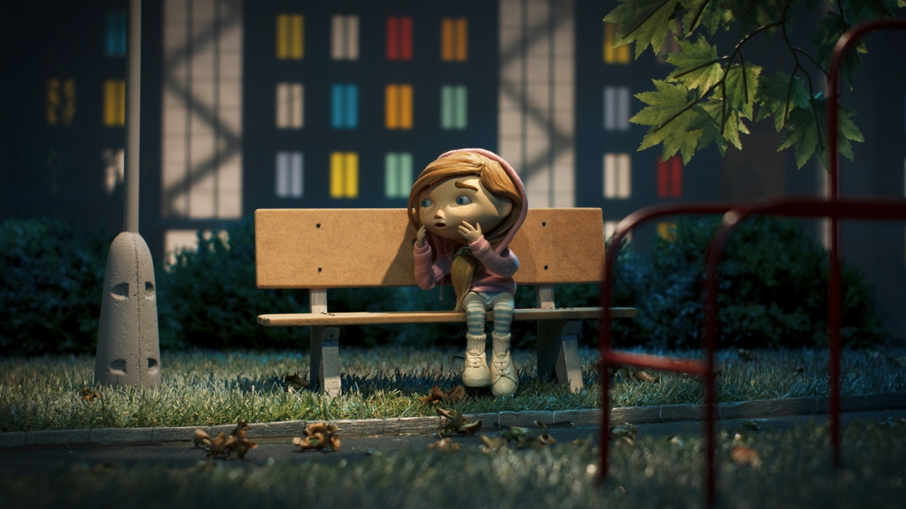

# My latest projects

## Babu in the Night City 

### Director’s statement
_"Following the mysterious disappearance of her dad, 8-year-old Babu is often alone at home with her parrot. When a thief steals it, Babu sets off on a night-time expedition to save her animal friend. During her journey, she finds unexpected allies: an unsuccessful rapper, a night jogger and a homeless man. Together, they must overcome the mad Professor X who is able to transform humans into animals and vice versa. A film-noir detective puppet-animated story takes place in a contemporary night-time city where the inhabitants take on dimensions of fairy-tale characters and all the while don ́t lose touch with everyday social reality."_ 

-_Petr Vodička_ 

 

https://ceeanimation.eu/projects/babu-in-the-night-city-2/ 

### My work at Anima studio

Almost a year ago, I got accepted into Anima studio s.r.o. to work on their first full-lengh film: _Babu in the night city_. I sculpt lip-synk in 3D programs for a lot of characters. I also edit any body parts that needs to be changed. Then it all gets 3D printed so my colleagues can animate with it. 

It was actually a bit of a challenge at first. Lip-synk in Czech puppetry is not something that is usually done. Some projects even failed pretty hard in that regard. But I think we found our own strategy how to make it. I’m most likely the youngest person that works on that project, so I try to bring as much innovation that I can. It is a big honor and responsibility. 

I have worked on more then 10 characters. I probably did close to 60 (probably more, I’ve stopped counting) expressions. And I can now do it much faster and better then before. 

If things go smoothly, the film should come out in 2026. I hope everything goes well. It could be very important thing for me in the future. 

_Older lip-synk_

## Cat’s life ("Under the Cat’s Weather")

This was done as a passion project/exersice in story, character design and storyboard. _Under the cat’s weather_ (hint to the popular saying "under the dog’s weather), is a little story concept about a family of cats living their usual cat life, until the arrival of one disordely kitten. Such a happy surprise for the main character’s birthday...How happy she must have been to get a little sibling, who is gonna steal her spotligh soon... 

It is a smaller project in the style of "animals going on an adventure", which were popular in the 1980s-1990s in children media, in the life-action form or animated. It tackles the typical life of anthropomorphic cats living their best yet sometimes mischievous lives with a loving owner. Until the family problems arrise. But it also gets into some more serious issues, that even people can face (like feelings of not being enough or coming to terms with our own mortality). 

_Cat’s together_
  
The main cast consists of:
  1. Blanka - a prideful sphynx cat who needs to learn to be comfortable in her own skin
  2. Rupert - little energetic bengal kitten who is stealing Blanka’s spotlight and acts like a spoiled brat
  3. Claudius - an old wise male maine coon cat, trying to keep the family together while his age has finally caught up with him

_A few pages of storyboard_

The storyboard is about how Blanka got a brand new brother for her birthday. Well...let’s just say it was a surprise to die for... 

## The Boots Walk Quietly

_Mr. Acornie is a little oak pixie, who lives peacefully in a little forest. But that all changes. On one fatefull day, a terrible evil with sharp teeth and two shoelaces walks into his life. Will he win his fight for survival? Or will the terrifying shoe devore him alive? We will see…_

_Boots walk quietly film shots_

_The Boots walk quietly_ is an animated 2-minute short animated film created in the last summer. Genre-wise it is an animated horror with fairy tale aspects sprinkled in. The main themes are facing one’s fear, inanimate objects coming to life and nature vs. man’s creations (which is an old creepy boot that was left to rot in the forest). 

To bring this story to life, I created around 30 digital illustrations (for this short, only 10 were used in the end) and then I animated it in After Effects. Then I just edited it in Premiere Pro, added sound and voila! I have spend whole August drawing everything and I animated it in two weeks, which was very exhausing. 

The film was left open-ended and with a lot of illustrations left to be animated. So I have decided to make it into my Bachelot work. The short was also recently accepted into "Prague Youth festival". And a few illustrations were used for our school exhibition on Náplavka or in the park next to our building. 

You can watch the whole short here: https://www.youtube.com/watch?v=OsIBCO0sSIc

_Mr. Acornie character exploration_

Read my "One word" essay here: 
- [Writing](Writing.md)

- [About me](About_me.md) 
- [My work](My_work.md) - you are here
